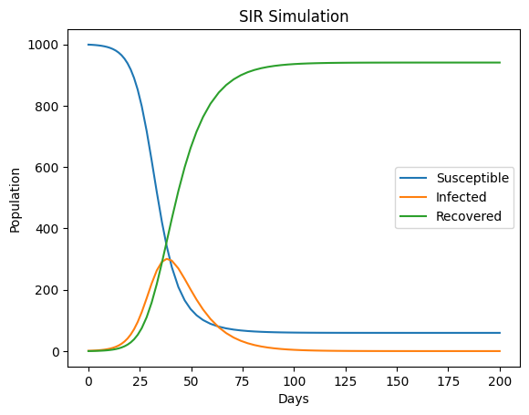
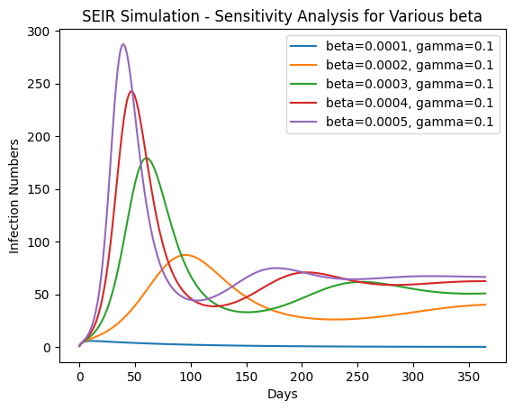
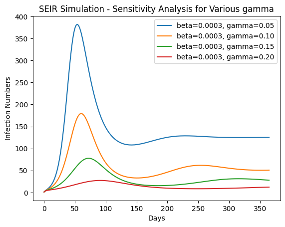

# BMI500_SIR-SEIR
## BMI500 Homework Week 11 Report
### Selected Topic: HW1 - SIR and SEIR Model Implementation for Pandemic Spread
### Disclaimer
No generative AI (in any form) has been used to complete this homework.

## Name and Contact
**Name:** Mingyang Wei  
**Contact:** mingyang.wei@emory.edu

## Question Answer
### B) SIR Model Simulation: Generate a plot showing the dynamics of S, I, and R over time. Label each curve clearly to indicate the compartment it represents.
The plot is shown as follows.

### C) Analysis and Interpretation: Analyze the results of your simulation, focusing on the following aspects:
#### 1. **Infection peak:** Identify the point in time where the number of infected individuals $I(t)$ reaches its maximum value. Discuss the factors contributing to this peak.
From the figure in section B, we can see that the infection number peak comes around the 35th day. For the factors contributing to this peak, I think the initial number of susceptible individuals, transmission rate, and recovery rate may affect the peak. With a higher initial number of susceptible individuals, a higher transmission rate or a lower recovery rate may make the peak earlier and higher.

#### 2. **Basic reproductive number $R_0$:** Calculate and interpret the basic reproductive number $R_0 = \frac{\beta}{\gamma}$. Explain how $R_0$ influences the overall dynamics of the pandemic, particularly in terms of infection spread and control.
$R_0 = \frac{\beta}{\gamma} =  \frac{0.0003}{0.1} = 0.003$. The basic reproductive number reflects the average number of new infections caused by a single individual in a fully susceptible population. A higher $R_0$ means each infected individual can pass the infection to more people. The infection spread means $R_0$ is more than 1, indicating one individual can pass the infection to many people. The infection control means $R_0$ is less than 1, indicating each infected individual is less likely to infect others.

#### 3. **Pandemic dynamics:** Describe the general behavior of the $S$, $I$, and $R$ populations over time. Discuss how the interactions between these compartments represent the spread and eventual containment of the infection.
S starts high and decreases when more individuals become infected. The decreasing rate somehow illustrates the transmission rate. I initially increased because the disease spread fast at first. When it reaches its peak, it starts to decrease as more individuals are recovering. R increases over time showing the infected individuals recovering, controlled by the recovery rate. The increase and decrease of SIR show a pattern in a pandemic, which is at first the disease spreads fast, with the infection number increasing a lot. Later, more and more infected individuals start to recover, showing a decrease in the infection number.

### D) SEIR Model with Births and Deaths
The simulation plots for 365 days and 1200 days are as follows.

#### iii. Discuss the pattern observed in the number of infections in terms of waves of the pandemic.
From the two figures, we can see that the infection number first increases a lot, and rapidly reaches the peak, because the disease spread quickly at first. Then falls back to a low level, and this may be because more and more infected individuals start to recover and some of them become immune to this disease. Subsequently, it increases a little bit again and returns to a stable level. This secondary peak may be because of the increasing number of susceptible individuals, due to some recovered individuals becoming susceptible again or due to more new births. The last stable level indicates the pandemic has been in control.

#### iv. Discuss the effect of the exposed compartment and birth/death rates on the pandemic dynamics.
In the SEIR model, $\sigma$ controls the exposed compartment, indicating the rate of an individual from being exposed to being infected. A higher $\sigma$ will shorten the exposed period and may increase the infection number peak but decrease the exposed number peak. $\mu$ controls the birth/death rate and maintains the population dynamics. With a higher $\mu$, the number of susceptible individuals may continue to increase, making the pandemic period more long-lasting.

### E) Sensitivity Analysis
The various $\beta$ and $\gamma$ results are shown as follows.

#### iii. Discuss the implications for public health interventions, relating β to social distancing and γ to medical treatments.
From the $\beta$ figure, we can see that a higher $\beta$ will increase the peak infection numbers and make the peak earlier. $\beta$ is the transmission rate, denoting the average number of infected individuals transmitted to susceptible individuals per unit of time by an infected individual. A higher $\beta$ means the disease spreads faster. Control and increased social distance can decrease $\beta$, thus slowing down the disease spreading and the infection number peak.

From the $\gamma$ figure, we can see that a higher $\gamma$ will decrease the infection number peak. $\gamma$ is the recovery rate, denoting the average rate at which an individual transitions from an infected state to a recovered state. A higher $\gamma$ means an infected individual will become healthy in a shorter time, thus decreasing the infection number peak and reducing the overall infection level. Increasing the $\gamma$ can be achieved through medical interventions, such as providing more effective treatments or speeding up the treatment process.

## Key Insights
This homework shows the foundation and the implementation of SIR and SEIR and discusses the effect of different parameters like transmission rate $\beta$ and recovery rate $\gamma$. The comparison between 365 days and 1200 days SEIR shows the pandemic analysis should be long-lasting. The sensitivity analysis makes me obtain a deeper understanding of how to utilize the theoretical analysis on practical problems.

## Comparative model performance
SIR and SEIR are more like statistic models, with different parameters and mathematic equations. SEIR has two more parameters than SIR model, showing a more comprehensive modeling in a pandemic. The participation of exposed compartment and birth/death rate makes the modeling closer to reality and enables SEIR to simulate a more complicated situation.

## Relevance to model-based machine learning
Although SIR and SEIR are statistic models, not involve a training process, they can also be combined with other machine learning models to enhance their ability. Besides, their parameters like $\beta$, $\gamma$, $\mu$, and $\sigma$ can also be optimized by machine learning methods to make the modeling closer to reality.

## Suggestions for future modeling improvements
Maybe we can develop other methods to train more parameters, make the parameters dynamic, make parameters and features multimodal, or make the data real-time, to improve the modeling ability.